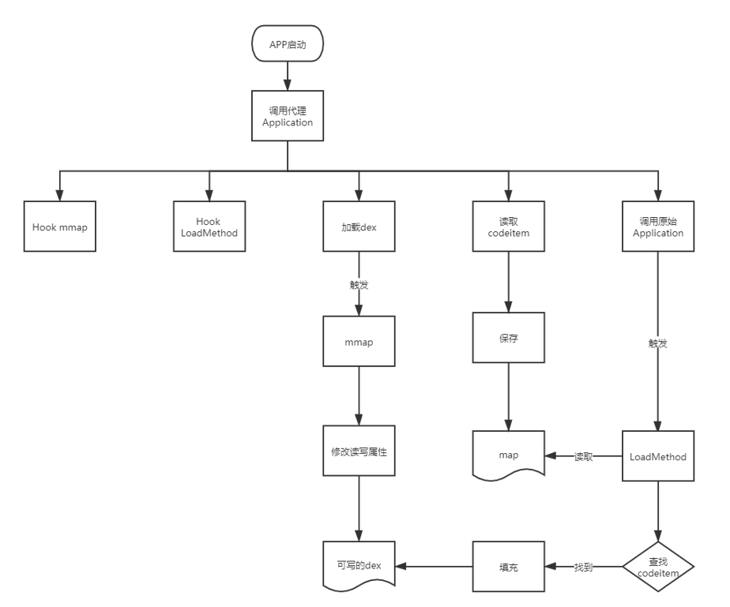
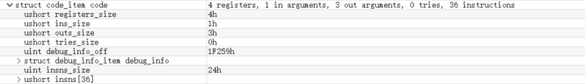

## 0x0 前言

函数抽取壳这个词不知道从哪起源的，但我理解的函数抽取壳是那种将dex文件中的函数代码给nop，然后在运行时再把字节码给填回dex的这么一种壳。

函数抽取前：


函数抽取后：


## 0x1 项目的结构

dpt代码分为两个部分，一个是processor，另一个是shell。

processor是可以将普通apk处理成加壳apk的模块。它的主要功能有：

- 解压apk

- 提取apk中的dex的CodeItem保存起来

- 修改AndroidManifest.xml中的Application类名

- 生成新的apk

流程如下：


shell模块最终生成的dex文件和so文件将被集成到需要加壳的apk中。它的要功能有：

- 处理App的启动

- 替换dexElements

- hook相关函数

- 调用目标Application

- CodeItem文件读取

- CodeItem填回


流程如下：




## 0x2 processor

processor比较重要的逻辑两点，AndroidManifest.xml的处理和CodeItem的提取

### （1）处理AndroidManifest.xml

我们处理AndroidManifest.xml的操作主要是备份原Application的类名和写入壳的代理Application的类名。备份原Application类名目的是在壳的流程执行完成后，调用我们原APK的Application。写入壳的代理Application类名的目的是在app启动时尽早的启动我们的代理Application，这样我们就可以做一些准备工作，比如自定义加载dex,Hook一些函数等。我们知道，AndroidManifest.xml在生成apk后它不是以普通xml文件的格式来存放的，而是以axml格式来存放的。不过幸运的是，已经有许多大佬写了对axml解析和编辑的库，我们直接拿来用就行。这里用到的axml处理的库是[ManifestEditor](https://github.com/WindySha/ManifestEditor)。

提取原AndroidManifest.xml Application完整类名代码如下，直接调用getApplicationName函数即可

```java

    public static String getValue(String file,String tag,String ns,String attrName){
        byte[] axmlData = IoUtils.readFile(file);
        AxmlParser axmlParser = new AxmlParser(axmlData);
        try {
            while (axmlParser.next() != AxmlParser.END_FILE) {
                if (axmlParser.getAttrCount() != 0 && !axmlParser.getName().equals(tag)) {
                    continue;
                }
                for (int i = 0; i < axmlParser.getAttrCount(); i++) {
                    if (axmlParser.getNamespacePrefix().equals(ns) && axmlParser.getAttrName(i).equals(attrName)) {
                        return (String) axmlParser.getAttrValue(i);
                    }
                }
            }
        } catch (Exception e) {
            e.printStackTrace();
        }
        return null;
    }

    public static String getApplicationName(String file) {
        return getValue(file,"application","android","name");
    }
```

写入Application类名的代码如下：

```java
    public static void writeApplicationName(String inManifestFile, String outManifestFile, String newApplicationName){
        ModificationProperty property = new ModificationProperty();
        property.addApplicationAttribute(new AttributeItem(NodeValue.Application.NAME,newApplicationName));

        FileProcesser.processManifestFile(inManifestFile, outManifestFile, property);

    }
```

### (2) 提取CodeItem

CodeItem是dex文件中存放函数字节码相关数据的结构。下图显示的就是CodeItem大概的样子。



说是提取CodeItem，其实我们提取的是CodeItem中的insns，它里面存放的是函数真正的字节码。提取insns，我们使用的是Android源码中的[dx](https://android.googlesource.com/platform/dalvik/+/refs/heads/master/dx/)工具，使用dx工具可以很方便的读取dex文件的各个部分。

下面的代码遍历所有ClassDef，并遍历其中的所有函数，再调用extractMethod对单个函数进行处理。

```java
    public static List<Instruction> extractAllMethods(File dexFile, File outDexFile) {
        List<Instruction> instructionList = new ArrayList<>();
        Dex dex = null;
        RandomAccessFile randomAccessFile = null;
        byte[] dexData = IoUtils.readFile(dexFile.getAbsolutePath());
        IoUtils.writeFile(outDexFile.getAbsolutePath(),dexData);

        try {
            dex = new Dex(dexFile);
            randomAccessFile = new RandomAccessFile(outDexFile, "rw");
            Iterable<ClassDef> classDefs = dex.classDefs();
            for (ClassDef classDef : classDefs) {
                
                ......
                
                if(classDef.getClassDataOffset() == 0){
                    String log = String.format("class '%s' data offset is zero",classDef.toString());
                    logger.warn(log);
                    continue;
                }

                ClassData classData = dex.readClassData(classDef);
                ClassData.Method[] directMethods = classData.getDirectMethods();
                ClassData.Method[] virtualMethods = classData.getVirtualMethods();
                for (ClassData.Method method : directMethods) {
                    Instruction instruction = extractMethod(dex,randomAccessFile,classDef,method);
                    if(instruction != null) {
                        instructionList.add(instruction);
                    }
                }

                for (ClassData.Method method : virtualMethods) {
                    Instruction instruction = extractMethod(dex, randomAccessFile,classDef, method);
                    if(instruction != null) {
                        instructionList.add(instruction);
                    }
                }
            }
        }
        catch (Exception e){
            e.printStackTrace();
        }
        finally {
            IoUtils.close(randomAccessFile);
        }

        return instructionList;
    }
```

处理函数的过程中发现没有代码（通常为native函数）或者insns的容量不足以填充return语句则跳过处理。这里就是对应函数抽取壳的抽取操作

```java
    private static Instruction extractMethod(Dex dex ,RandomAccessFile outRandomAccessFile,ClassDef classDef,ClassData.Method method)
            throws Exception{
        String returnTypeName = dex.typeNames().get(dex.protoIds().get(dex.methodIds().get(method.getMethodIndex()).getProtoIndex()).getReturnTypeIndex());
        String methodName = dex.strings().get(dex.methodIds().get(method.getMethodIndex()).getNameIndex());
        String className = dex.typeNames().get(classDef.getTypeIndex());
        //native函数
        if(method.getCodeOffset() == 0){
            String log = String.format("method code offset is zero,name =  %s.%s , returnType = %s",
                    TypeUtils.getHumanizeTypeName(className),
                    methodName,
                    TypeUtils.getHumanizeTypeName(returnTypeName));
            logger.warn(log);
            return null;
        }
        Instruction instruction = new Instruction();
        //16 = registers_size + ins_size + outs_size + tries_size + debug_info_off + insns_size
        int insnsOffset = method.getCodeOffset() + 16;
        Code code = dex.readCode(method);
        //容错处理
        if(code.getInstructions().length == 0){
            String log = String.format("method has no code,name =  %s.%s , returnType = %s",
                    TypeUtils.getHumanizeTypeName(className),
                    methodName,
                    TypeUtils.getHumanizeTypeName(returnTypeName));
            logger.warn(log);
            return null;
        }
        int insnsCapacity = code.getInstructions().length;
        //insns容量不足以存放return语句，跳过
        byte[] returnByteCodes = getReturnByteCodes(returnTypeName);
        if(insnsCapacity * 2 < returnByteCodes.length){
            logger.warn("The capacity of insns is not enough to store the return statement. {}.{}() -> {} insnsCapacity = {}byte(s),returnByteCodes = {}byte(s)",
                    TypeUtils.getHumanizeTypeName(className),
                    methodName,
                    TypeUtils.getHumanizeTypeName(returnTypeName),
                    insnsCapacity * 2,
                    returnByteCodes.length);

            return null;
        }
        instruction.setOffsetOfDex(insnsOffset);
        //这里的MethodIndex对应method_ids区的索引
        instruction.setMethodIndex(method.getMethodIndex());
        //注意：这里是数组的大小
        instruction.setInstructionDataSize(insnsCapacity * 2);
        byte[] byteCode = new byte[insnsCapacity * 2];
        //写入nop指令
        for (int i = 0; i < insnsCapacity; i++) {
            outRandomAccessFile.seek(insnsOffset + (i * 2));
            byteCode[i * 2] = outRandomAccessFile.readByte();
            byteCode[i * 2 + 1] = outRandomAccessFile.readByte();
            outRandomAccessFile.seek(insnsOffset + (i * 2));
            outRandomAccessFile.writeShort(0);
        }
        instruction.setInstructionsData(byteCode);
        outRandomAccessFile.seek(insnsOffset);
        //写出return语句
        outRandomAccessFile.write(returnByteCodes);

        return instruction;
    }
```

## 0x3 shell模块

shell模块是函数抽取壳的主要逻辑，它的功能我们上面已经讲过。

### (1) Hook函数

Hook函数时机最好要早点，dpt在`_init`函数中开始进行一系列HOOK

```cpp
extern "C" void _init(void) {
    dpt_hook();
}
```

Hook框架使用的[Dobby](https://github.com/jmpews/Dobby)和[bhook](https://github.com/bytedance/bhook)，主要Hook两个函数：mmap和LoadMethod。

#### **mmap**

Hook mmap函数的目的是在我们加载dex能够修改dex的属性，让加载的dex可写，这样我们才能把字节码填回dex，有大佬详细的分析过，具体参考[这篇文章](https://bbs.pediy.com/thread-266527.htm)。

```cpp
bytehook_stub_t stub = bytehook_hook_single(
        getArtLibName(),
        "libc.so",
        "mmap",
        (void*)fake_mmap,
        nullptr,
        nullptr);
if(stub != nullptr){
    DLOGD("mmap hook success!");
}
```
Hook到了之后，给__prot参数追加PROT_WRITE属性

```cpp
void* fake_mmap(void* __addr, size_t __size, int __prot, int __flags, int __fd, off_t __offset){
    BYTEHOOK_STACK_SCOPE();
    int hasRead = (__prot & PROT_READ) == PROT_READ;
    int hasWrite = (__prot & PROT_WRITE) == PROT_WRITE;
    int prot = __prot;

    if(hasRead && !hasWrite) {
        prot = prot | PROT_WRITE;
        DLOGD("fake_mmap call fd = %p,size = %d, prot = %d,flag = %d",__fd,__size, prot,__flags);
    }

    void *addr = BYTEHOOK_CALL_PREV(fake_mmap,__addr,  __size, prot,  __flags,  __fd,  __offset);
    return addr;
}
```

#### **LoadMethod**

在Hook LoadMethod函数之前，我们需要了解LoadMethod函数流程。为什么是这个LoadMethod函数，其他函数是否可行？

当一个类被加载的时候，它的调用链是这样的(部分流程已省略)：

```
ClassLoader.java::loadClass -> DexPathList.java::findClass -> DexFile.java::defineClass -> class_linker.cc::LoadClass -> class_linker.cc::LoadClassMembers -> class_linker.cc::LoadMethod
```

也就是说，当一个类被加载，它是会去调用LoadMethod函数的，我们看一下它的函数原型：

```cpp
void ClassLinker::LoadMethod(const DexFile& dex_file,
                             const ClassDataItemIterator& it,
                             Handle<mirror::Class> klass,
                             ArtMethod* dst);
```

这个函数太爆炸了，它有两个爆炸性的参数，DexFile和ClassDataItemIterator，我们可以从这个函数得到当前加载函数所在的DexFile结构和当前函数的一些信息，可以看一下ClassDataItemIterator结构：

```cpp
  class ClassDataItemIterator{
  
  ......
  
  // A decoded version of the method of a class_data_item
  struct ClassDataMethod {
    uint32_t method_idx_delta_;  // delta of index into the method_ids array for MethodId
    uint32_t access_flags_;
    uint32_t code_off_;
    ClassDataMethod() : method_idx_delta_(0), access_flags_(0), code_off_(0) {}

   private:
    DISALLOW_COPY_AND_ASSIGN(ClassDataMethod);
  };
  ClassDataMethod method_;

  // Read and decode a method from a class_data_item stream into method
  void ReadClassDataMethod();

  const DexFile& dex_file_;
  size_t pos_;  // integral number of items passed
  const uint8_t* ptr_pos_;  // pointer into stream of class_data_item
  uint32_t last_idx_;  // last read field or method index to apply delta to
  DISALLOW_IMPLICIT_CONSTRUCTORS(ClassDataItemIterator);
};
```

其中最重要的字段就是`code_off_`它的值是当前加载的函数的CodeItem相对于DexFile的偏移，当相应的函数被加载，我们就可以直接访问到它的CodeItem。其他函数是否也可以？在上面的流程中没有比LoadMethod更适合我们Hook的函数，所以它是最佳的Hook点。

Hook LoadMethod稍微复杂一些，倒不是Hook代码复杂，而是Hook触发后处理的代码比较复杂，我们要适配多个Android版本，每个版本LoadMethod函数的参数都可能有改变，幸运的是，LoadMethod改动也不是很大。那么，我们如何读取ClassDataItemIterator类中的`code_off_`呢？比较直接的做法是计算偏移，然后在代码中维护一份偏移。不过这样的做法不易阅读很容易出错。dpt的做法是把ClassDataItemIterator类拷过来，然后将ClassDataItemIterator引用直接转换为我们自定义的ClassDataItemIterator引用，这样就可以方便的读取字段的值。

下面是LoadMethod被调用后做的操作，逻辑是读取存在map中的insns，然后将它们填回指定位置。

```cpp
void LoadMethod(void *thiz, void *self, const void *dex_file, const void *it, const void *method,
                void *klass, void *dst) {

    if (g_originLoadMethod25 != nullptr
        || g_originLoadMethod28 != nullptr
        || g_originLoadMethod29 != nullptr) {
        uint32_t location_offset = getDexFileLocationOffset();
        uint32_t begin_offset = getDataItemCodeItemOffset();
        callOriginLoadMethod(thiz, self, dex_file, it, method, klass, dst);

        ClassDataItemReader *classDataItemReader = getClassDataItemReader(it,method);


        uint8_t **begin_ptr = (uint8_t **) ((uint8_t *) dex_file + begin_offset);
        uint8_t *begin = *begin_ptr;
        // vtable(4|8) + prev_fields_size
        std::string *location = (reinterpret_cast<std::string *>((uint8_t *) dex_file +
                                                                 location_offset));
        if (location->find("base.apk") != std::string::npos) {

            //code_item_offset == 0说明是native方法或者没有代码
            if (classDataItemReader->GetMethodCodeItemOffset() == 0) {
                DLOGW("native method? = %s code_item_offset = 0x%x",
                      classDataItemReader->MemberIsNative() ? "true" : "false",
                      classDataItemReader->GetMethodCodeItemOffset());
                return;
            }

            uint16_t firstDvmCode = *((uint16_t*)(begin + classDataItemReader->GetMethodCodeItemOffset() + 16));
            if(firstDvmCode != 0x0012 && firstDvmCode != 0x0016 && firstDvmCode != 0x000e){
                NLOG("this method has code no need to patch");
                return;
            }

            uint32_t dexSize = *((uint32_t*)(begin + 0x20));

            int dexIndex = dexNumber(location);
            auto dexIt = dexMap.find(dexIndex - 1);
            if (dexIt != dexMap.end()) {

                auto dexMemIt = dexMemMap.find(dexIndex);
                if(dexMemIt == dexMemMap.end()){
                    changeDexProtect(begin,location->c_str(),dexSize,dexIndex);
                }


                auto codeItemMap = dexIt->second;
                int methodIdx = classDataItemReader->GetMemberIndex();
                auto codeItemIt = codeItemMap->find(methodIdx);

                if (codeItemIt != codeItemMap->end()) {
                    CodeItem* codeItem = codeItemIt->second;
                    uint8_t  *realCodeItemPtr = (uint8_t*)(begin +
                                                classDataItemReader->GetMethodCodeItemOffset() +
                                                16);

                    memcpy(realCodeItemPtr,codeItem->getInsns(),codeItem->getInsnsSize());
                }
            }
        }
    }
}
```

### (2) 加载dex

其实dex在App启动的时候已经被加载过一次了，但是，我们为什么还要再加载一次？因为系统加载的dex是以只读方式加载的，我们没办法去修改那一部分的内存。而且App的dex加载早于我们Application的启动，这样，我们在代码根本没法感知到，所以我们要重新加载dex。

```java
    private ClassLoader loadDex(Context context){
        String sourcePath = context.getApplicationInfo().sourceDir;
        String nativePath = context.getApplicationInfo().nativeLibraryDir;

        ShellClassLoader shellClassLoader = new ShellClassLoader(sourcePath,nativePath,ClassLoader.getSystemClassLoader());
        return shellClassLoader;
    }
```

自定义的ClassLoader

```java
public class ShellClassLoader extends PathClassLoader {

    private final String TAG = ShellClassLoader.class.getSimpleName();

    public ShellClassLoader(String dexPath,ClassLoader classLoader) {
        super(dexPath,classLoader);
    }

    public ShellClassLoader(String dexPath, String librarySearchPath,ClassLoader classLoader) {
        super(dexPath, librarySearchPath, classLoader);
    }
}
```

### (3) 替换dexElements

这一步也非常重要，这一步的目的是使ClassLoader从我们新加载的dex文件中加载类。代码如下：

```cpp
void mergeDexElements(JNIEnv* env,jclass klass,jobject oldClassLoader,jobject newClassLoader){
    jclass BaseDexClassLoaderClass = env->FindClass("dalvik/system/BaseDexClassLoader");
    jfieldID  pathList = env->GetFieldID(BaseDexClassLoaderClass,"pathList","Ldalvik/system/DexPathList;");
    jobject oldDexPathListObj = env->GetObjectField(oldClassLoader,pathList);
    if(env->ExceptionCheck() || nullptr == oldDexPathListObj ){
        env->ExceptionClear();
        DLOGW("mergeDexElements oldDexPathListObj get fail");
        return;
    }
    jobject newDexPathListObj = env->GetObjectField(newClassLoader,pathList);
    if(env->ExceptionCheck() || nullptr == newDexPathListObj){
        env->ExceptionClear();
        DLOGW("mergeDexElements newDexPathListObj get fail");
        return;
    }

    jclass DexPathListClass = env->FindClass("dalvik/system/DexPathList");
    jfieldID  dexElementField = env->GetFieldID(DexPathListClass,"dexElements","[Ldalvik/system/DexPathList$Element;");


    jobjectArray newClassLoaderDexElements = static_cast<jobjectArray>(env->GetObjectField(
            newDexPathListObj, dexElementField));
    if(env->ExceptionCheck() || nullptr == newClassLoaderDexElements){
        env->ExceptionClear();
        DLOGW("mergeDexElements new dexElements get fail");
        return;
    }

    jobjectArray oldClassLoaderDexElements = static_cast<jobjectArray>(env->GetObjectField(
            oldDexPathListObj, dexElementField));
    if(env->ExceptionCheck() || nullptr == oldClassLoaderDexElements){
        env->ExceptionClear();
        DLOGW("mergeDexElements old dexElements get fail");
        return;
    }

    jint oldLen = env->GetArrayLength(oldClassLoaderDexElements);
    jint newLen = env->GetArrayLength(newClassLoaderDexElements);

    DLOGD("mergeDexElements oldlen = %d , newlen = %d",oldLen,newLen);

    jclass ElementClass = env->FindClass("dalvik/system/DexPathList$Element");

    jobjectArray  newElementArray = env->NewObjectArray(oldLen + newLen,ElementClass, nullptr);

    for(int i = 0;i < newLen;i++) {
        jobject elementObj = env->GetObjectArrayElement(newClassLoaderDexElements, i);
        env->SetObjectArrayElement(newElementArray,i,elementObj);
    }


    for(int i = newLen;i < oldLen + newLen;i++) {
        jobject elementObj = env->GetObjectArrayElement(oldClassLoaderDexElements, i - newLen);
        env->SetObjectArrayElement(newElementArray,i,elementObj);
    }

    env->SetObjectField(oldDexPathListObj, dexElementField,newElementArray);

    DLOGD("mergeDexElements success");
}
```